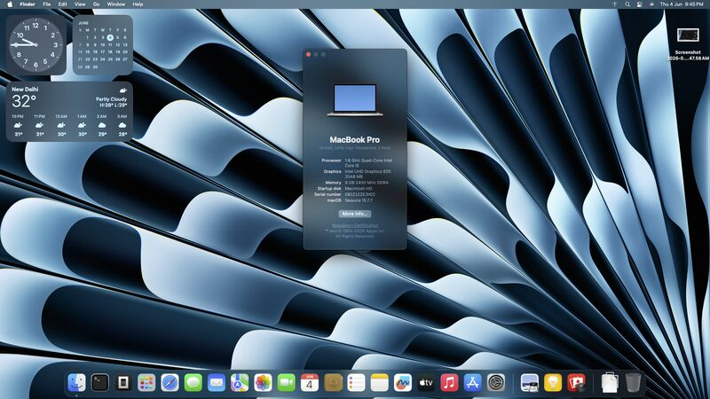
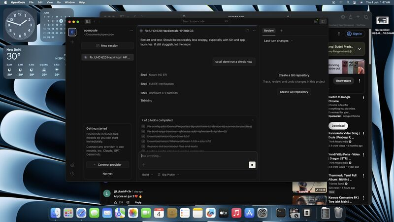
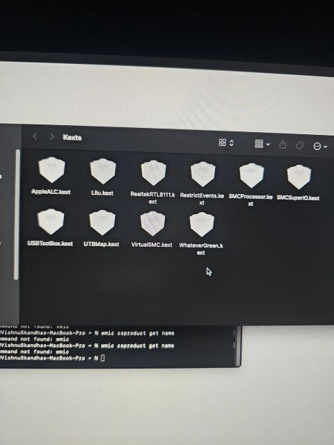
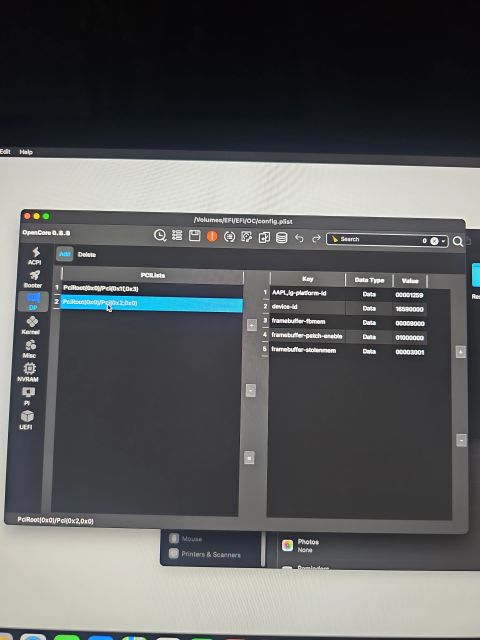
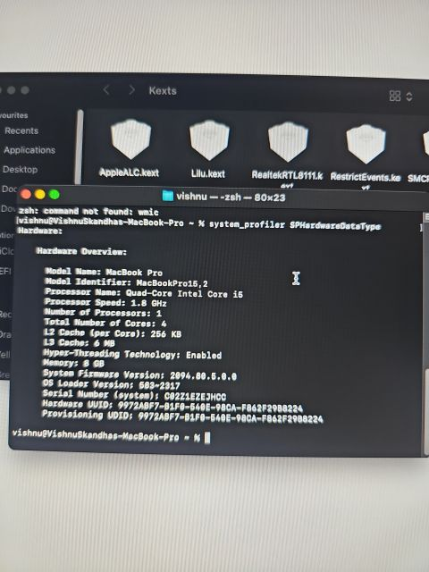

<p align="center">
  
</p>

<h1 align="center">HP 200 G3 All-in-One · OpenCore Hackintosh</h1>

<p align="center">
  <b>macOS Sequoia on an HP 200 G3 AIO — stable boot, full Intel UHD 620 acceleration,
  mapped USB, audio, wired LAN and USB Wi-Fi.</b><br/>
  Built and documented the hard way: one failure at a time.
</p>

<p align="center">
  <a href="https://github.com/vishnuskandha/HP-200-G3-AIO-OpenCore/releases"></a>
  <a href="https://github.com/vishnuskandha/HP-200-G3-AIO-OpenCore/releases"></a>
  
  
  <a href="LICENSE"></a>
  <a href="https://github.com/vishnuskandha/HP-200-G3-AIO-OpenCore"></a>
  <a href="https://github.com/vishnuskandha/HP-200-G3-AIO-OpenCore/issues"></a>
</p>

<p align="center">
  <a href="#-quick-start">Quick start</a> ·
  <a href="#-what-works">What works</a> ·
  <a href="#-documentation">Documentation</a> ·
  <a href="#-the-debugging-story">The debugging story</a> ·
  <a href="#-contributing">Contributing</a>
</p>

---

> [!CAUTION]
> **Hackintosh is a learning project, not a supported configuration.**
> macOS is licensed by Apple and is only intended to run on Apple hardware.
> You are responsible for complying with Apple's software license agreement.
> This repository is **not affiliated with Apple**, and the author is not
> responsible for anything you do with this EFI.
>
> **Before installing, generate your own SMBIOS** with GenSMBIOS — the values in
> `EFI/OC/config.plist` belong to this machine's build and re-using them can
> break iMessage, FaceTime and cause Apple-ID conflicts. See
> [docs/07-smbios-icloud.md](docs/07-smbios-icloud.md).

---

## ✨ What this is

A complete, **working OpenCore EFI** for the **HP 200 G3 All-in-One** (21.5″ FHD,
Intel Core i5-8250U, Intel UHD Graphics 620) running **macOS Sequoia**.

The EFI is a drop-in package: BIOS settings + USB creation + copy `EFI/` + boot.
Everything was tested on real hardware and every working subsystem is documented —
including the **exact fix for the infamous "7 MB VRAM" black screen** that most
Kaby-Lake-R iGPU builds hit ([docs/05-debugging-journey.md](docs/05-debugging-journey.md)).

The original engineering write-up is on the [author's blog](https://vishnuskandha.qzz.io/blog/opencore-hackintosh-debugging).

<p align="center">
  
  
  
  
</p>

## 🖥️ Hardware

| Component | Model | macOS support |
|---|---|---|
| CPU | Intel Core **i5-8250U** (Kaby Lake-R, 4C/8T) | ✅ native |
| iGPU | Intel **UHD Graphics 620** (PCI id `0x5916`) | ✅ accelerated, 2048 MB VRAM |
| Display | 21.5″ FHD (1920×1080) internal panel | ✅ internal eDP |
| RAM | 4–16 GB DDR4-2133 (2× SODIMM) | ✅ native |
| Audio | Realtek **ALC3247** (ALC256 family) | ✅ AppleALC `layout-id 3` |
| LAN | Realtek **RTL8111HSH** GbE | ✅ RealtekRTL8111.kext |
| WLAN (internal) | Realtek **RTL8821CE** M.2 | ❌ no macOS driver |
| Wi-Fi (added) | **MT7601** USB dongle | ✅ RT2870USBWirelessDriver.kext |
| Storage | 2.5″ SATA HDD/SSD | ✅ native |
| Webcam / mic | 1 MP HD webcam + dual-array mic (USB) | ✅ via USB map |
| USB | 2× USB 2.0, 2× USB 3.1 Gen1 + SD reader | ✅ custom UTBMap |

> ⚠️ **Wi-Fi note:** the built-in RTL8821CE has no macOS driver, so a cheap
> MediaTek MT7601 USB Wi-Fi dongle was used instead (supported by
> `RT2870USBWirelessDriver.kext`, WiFi only — no Bluetooth/AirDrop).
> For full Continuity you'd replace it with a Broadcom BCM94352Z/BCM94360NG.

## ✅ What works

- macOS **Sequoia** boot, updates-safe kernel config
- **Intel UHD 620 full acceleration** — 2048 MB VRAM, no black screen
- Internal display, internal speaker, headphone/mic combo jack
- **USB**: every port mapped with correct connector type — including the
  internal webcam + microphone (an all-in-one wires internal peripherals
  through the USB controller — the classic trap, see
  [docs/05-debugging-journey.md](docs/05-debugging-journey.md))
- Wired LAN (RTL8111), USB Wi-Fi (MT7601)
- CPU power management, RTC (HP "005 real time clock power loss" POST error patched)
- Recovery partition boot (needs network — see troubleshooting)
- Sleep (tested during development — report regressions in Issues)

## ⚠️ Partial / not tested

| Item | Status |
|---|---|
| Internal WLAN card (RTL8821CE) | ❌ no driver — use the USB dongle |
| AirDrop / Handoff / Continuity | ❌ requires Broadcom Wi-Fi card |
| SD card reader | 🟡 not tested |
| HDMI-out port | 🟡 not tested |
| Brightness keys | 🟡 not tested — software brightness works |
| iMessage / FaceTime | 🟡 works only with your own SMBIOS ([docs/07](docs/07-smbios-icloud.md)) |

## 🚀 Quick start

> Full walk-through with BIOS settings and screenshots:
> **[docs/02-installation.md](docs/02-installation.md)**

1. **Read the docs.** At minimum `01`, `02` and `07`.
2. **Generate your own SMBIOS** (MacBookPro15,2) with GenSMBIOS and put it into
   `EFI/OC/config.plist` → `PlatformInfo > Generic` (or use
   [`scripts/scrub_smbios.py`](scripts/scrub_smbios.py) first for a clean slate).
3. **Prepare the USB** — 8 GB+ stick, restore the macOS Sequoia installer
   (gibMacOS / macOS Recovery), mount the EFI partition and copy this `EFI/`
   folder over it.
4. **BIOS** — enable UEFI boot, disable Secure Boot, enable XHCI/USB legacy.
5. **Boot** from the USB, install, reboot, boot from the installed disk.
6. **Verify** with `scripts/validate_efi.py`.

## 📁 Repository layout

```
.
├── EFI/                        ← the working OpenCore package (drop-in)
│   └── OC/
│       ├── ACPI/               SSDT-EC, -PLUG, -RTCAWAC, -SBUS, -USBX, -MCHC
│       ├── Drivers/            HfsPlus, OpenRuntime, ResetNvramEntry
│       ├── Kexts/              Lilu, WhateverGreen, AppleALC, VirtualSMC, …
│       └── config.plist        the working configuration
├── docs/                       every decision explained
│   ├── 01-hardware.md          full spec sheet + macOS mapping
│   ├── 02-installation.md      step-by-step install guide
│   ├── 03-configuration.md     config.plist section-by-section
│   ├── 04-kexts-drivers.md     kext/driver table + safe update procedure
│   ├── 05-debugging-journey.md the 7 MB VRAM saga + fix, USB, network, RTC
│   ├── 06-troubleshooting.md   FAQ, boot-args reference, log collection
│   └── 07-smbios-icloud.md     why SMBIOS matters, GenSMBIOS guide
├── scripts/
│   ├── validate_efi.py         checks config/kexts/drivers consistency
│   └── scrub_smbios.py         strips SMBIOS for safe redistribution
├── screenshots/                evidence from the real machine
└── .github/                    issue template + CI config validation
```

## 📚 Documentation

| Doc | What you'll learn |
|---|---|
| [01-hardware](docs/01-hardware.md) | Every component and why it is configured the way it is |
| [02-installation](docs/02-installation.md) | From USB stick to a booting Sequoia |
| [03-configuration](docs/03-configuration.md) | What every `config.plist` section actually does |
| [04-kexts-drivers](docs/04-kexts-drivers.md) | Which kext does what, versions, how to update safely |
| [05-debugging-journey](docs/05-debugging-journey.md) | **The story**: 7 MB VRAM → 2048 MB, USB mapping, recovery networking, HP RTC |
| [06-troubleshooting](docs/06-troubleshooting.md) | If it breaks — where to look and how to report it |
| [07-smbios-icloud](docs/07-smbios-icloud.md) | iMessage/FaceTime safety, GenSMBIOS in 60 seconds |

## 🐛 The debugging story

This build was a systems-debugging project. The machine was not designed for macOS,
and every working subsystem required the *correct assumption* about hardware —
not just "more kexts". Highlights:

- **Black screen, 7 MB VRAM, UHD 620**: the framebuffer was configured for the
  generic Kaby Lake iGPU (`0x59120000`) while the machine ships the Kaby Lake-R
  part (`device-id 0x5916`). The fix: the matching framebuffer
  **`0x59160000`** plus `framebuffer-unifiedmem = 2048 MB` and connector boot-args.
- **A port that looks unused externally can still be essential** — the AIO's
  camera and microphone live on the internal USB controller.
- **A recovery failure that looked like an installer failure** was actually DNS —
  separated and fixed at the network layer.
- **Every change earned its place**: three versioned configs, one working EFI.

Full write-up: **[docs/05-debugging-journey.md](docs/05-debugging-journey.md)**
· [Blog post](https://vishnuskandha.qzz.io/blog/opencore-hackintosh-debugging)
· [LinkedIn](https://www.linkedin.com/posts/vishnuskandha_hackintosh-opencore-macos-activity-7473366444458549248-9uH-)

## 🤝 Contributing

Found a bug, a better framebuffer value, or a working BCM Wi-Fi swap?
Open an [issue](https://github.com/vishnuskandha/HP-200-G3-AIO-OpenCore/issues)
or a pull request — use the issue template so reports include the logs we
actually need (verbose boot, `ioreg`, EFI snapshot). See
[CONTRIBUTING.md](CONTRIBUTING.md) for the full workflow.

- **Please**: regenerate SMBIOS before sharing screenshots or your config.
- **Please**: attach OpenCore `verbose` log + `opencore-version` output.
- **Never**: commit real serial numbers. CI warns about this.
- **Security**: report vulnerabilities privately — see [SECURITY.md](SECURITY.md).

## 🙏 Credits

- [OpenCore](https://github.com/acidanthera/OpenCorePkg) and the [Dortania guides](https://dortania.github.io/OpenCore-Install-Guide/) — the foundation this EFI is built on
- [Lilu](https://github.com/acidanthera/Lilu), [WhateverGreen](https://github.com/acidanthera/WhateverGreen), [AppleALC](https://github.com/acidanthera/AppleALC), [VirtualSMC](https://github.com/acidanthera/VirtualSMC), [RestrictEvents](https://github.com/acidanthera/RestrictEvents)
- [RealtekRTL8111](https://github.com/Mieze/RTL8111_driver_for_mac_OS), [USBToolBox](https://github.com/USBToolBox/kext), [RT2870USBWirelessDriver](https://github.com/chris1111/Wireless-USB-Adapter) ecosystems

## 📄 License

Repository content (docs, config, scripts): MIT — see [LICENSE](LICENSE).
Redistributed OpenCore components remain under their own licenses.
